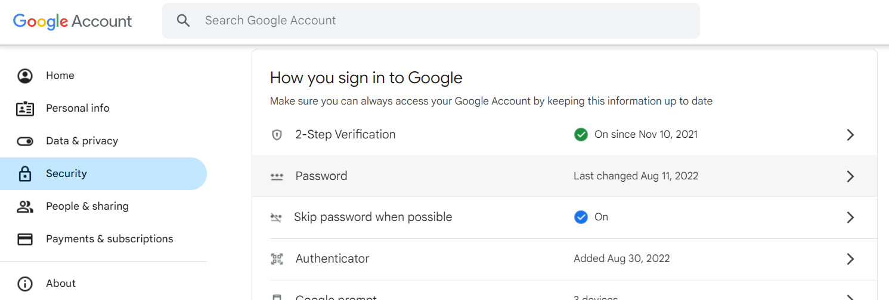
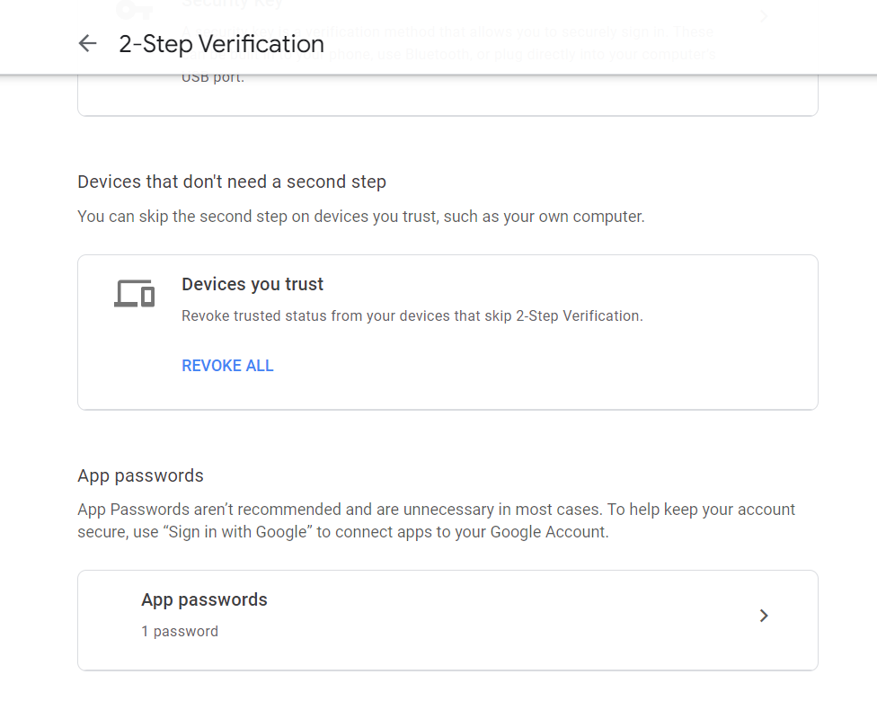
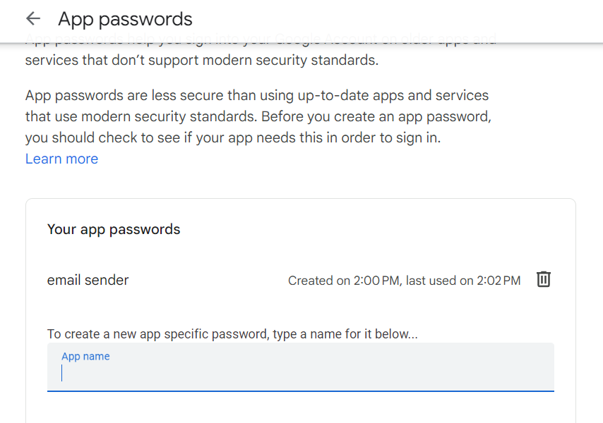
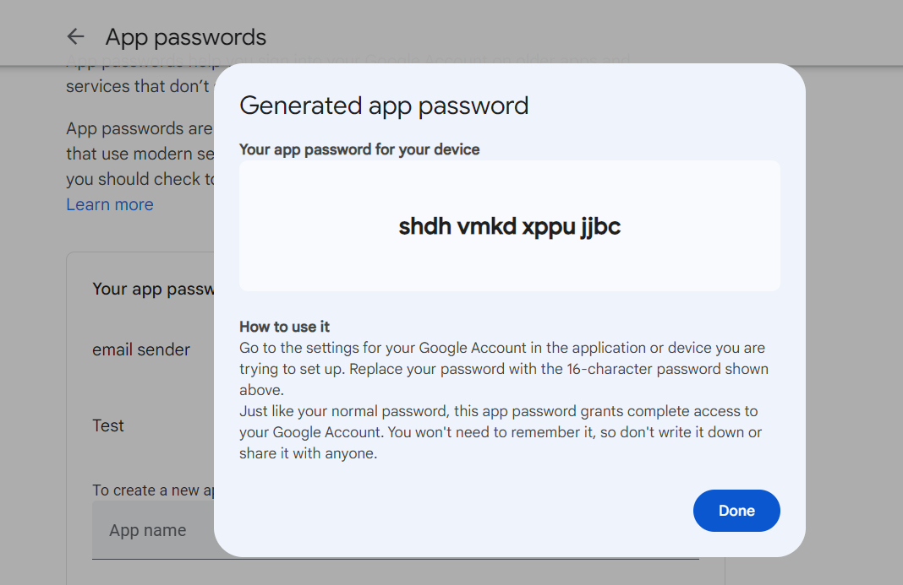

# Email Sender
- This project provide several email sending python code

## Make a csv or excel
- Make a csv or Excel to record all names and emails.
- The only requirement is that make the label have the 'Name' and 'Email'

## Make the ini account file
- There is a sample name as config.ini.
- Change your Email and Password to config.ini.

## Custom html
- As the title, use your own email template.
- I have provided a sample with url and document in template.html, rewrite it as you want.

## Special Setting
### Gmail
- Go to the Google account **Security**.
- Setup the 2-Step Verification.
    
- Click the **APP Passwords**
    
- Set the app name
    
- Get the password
    
    ps. The image is a fake password.

